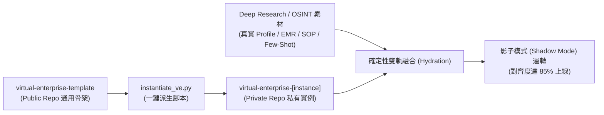

# 🚀 虛擬企業模板：部署與私有實例派生維運指南 (Deployment Guide)

## 1. 部署與隔離哲學 (Deployment Philosophy & Security Isolation)

依據 `[ADR-005]`，系統部署實施**「通用模板與私有標竿實例嚴格隔離」**模式：
- **`virtual-enterprise-template` (Public Repo)：** 僅維護純通用、抽象之 L0-L4 骨架、APQC/ISO 控制點與預設範本，作為單一真實來源 (SSOT Vessel)。包含公開公用腳本 ([virtual-enterprise-template/scripts/instantiate_ve.py](file:///Users/wuulong/github/bmad-pa/events-2026Q3/virtual-enterprise/virtual-enterprise-template/scripts/instantiate_ve.py)) 與中控總控表維運工具 ([virtual-enterprise-template/db/manage_ledger.py](file:///Users/wuulong/github/bmad-pa/events-2026Q3/virtual-enterprise/virtual-enterprise-template/db/manage_ledger.py))。
- **`virtual-enterprise-[instance]` (Private Repo)：** 針對特定標竿企業（如在宅醫療診所）所開立之私有儲存庫，用於承載經由 OSINT 收集之真實營運血肉、個案 Few-Shot 與敏感情境。

---

## 2. 全域實體狀態總控表維運 (`manage_ledger.py`)

維護中控 DB 內 `entity_state_ledger` 之全域看板與項目狀態：

```bash
# 1. 查詢影子測試中 (IN_SHADOW_TEST) 或卡關 (BLOCKED) 的資產
python3 db/manage_ledger.py list --status IN_SHADOW_TEST

# 2. 人類審查通過，手動更新狀態為 ACTIVE
python3 db/manage_ledger.py update SOP-OPS-001 --status ACTIVE --memo "2026-07-31 人類顧問審查通過，正式上線"

# 3. 手動註冊新 Agent 或 Workflow
python3 db/manage_ledger.py add AGT-MED-001 AGENT "行一診所院長 Agent" --prefix 05_OPS --status DRAFT
```

---

## 3. 起始自動化腳本 (`instantiate_ve.py`)

為了讓架構師能一鍵從通用模板派生全新的標竿虛擬企業實例：
- **專案內部腳本：** [events-2026Q3/virtual-enterprise/scripts/instantiate_ve.py](file:///Users/wuulong/github/bmad-pa/events-2026Q3/virtual-enterprise/scripts/instantiate_ve.py)
- **公開範本腳本：** [virtual-enterprise-template/scripts/instantiate_ve.py](file:///Users/wuulong/github/bmad-pa/events-2026Q3/virtual-enterprise/virtual-enterprise-template/scripts/instantiate_ve.py)

```bash
/usr/bin/python3 events-2026Q3/virtual-enterprise/scripts/instantiate_ve.py \
  events/mentors/xingyi/xingyi-ai-enablement/VE \
  --name "行一診所在宅醫療中心" \
  --code "XINGYI" \
  --init-git
```

---

## 4. 私有標竿實例派生與 Hydration 完整工序 (Step-by-Step Workflow)



### 步驟 1：執行一鍵派生腳本
發動 `instantiate_ve.py`，將通用骨架與 L0-L4 目錄結構複製至目標實例路徑，並完成 `db/control_plane.sqlite` 實體初始化與獨立 `git init`。

### 步驟 2：綁定 GitHub Private Remote 儲存庫
```bash
cd events/mentors/xingyi/xingyi-ai-enablement
git remote add origin https://github.com/wuulong/xingyi-ai-enablement.git
git add .
git commit -m "feat: initialize xingyi-ai-enablement with in-home clinic VE instance"
git push -u origin main
```

### 步驟 3：執行 OSINT 深核研究與血肉融合 (Hydration)
利用外包 Deep Research 工具收集標竿企業之真實營運情節，將血肉 Hydrate 填入 `book/`、`db/` 與各部門 SOP Markdown。

### 步驟 4：執行系統工程成熟度稽核
```bash
/usr/bin/python3 .agent/skills/system-engineer-navigator/scripts/se_manager.py audit events/mentors/xingyi
```

### 步驟 5：啟動影子模式 (Shadow Mode)
將去識別化日常個案抄送至私有沙盒運轉，計算對齊度達到 85% 後完成轉型切換。
